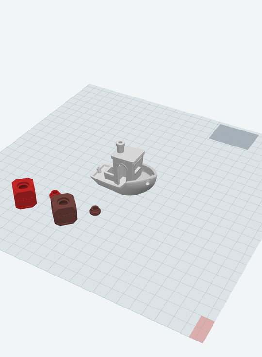
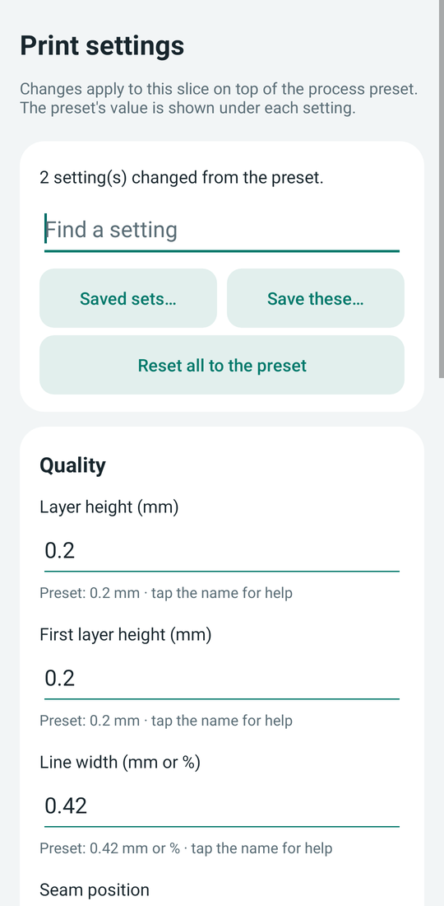
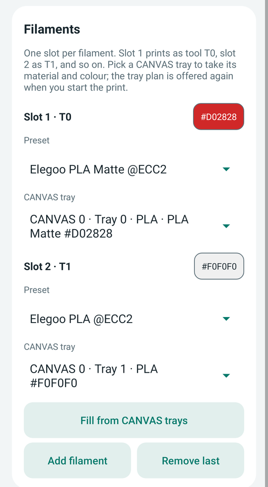
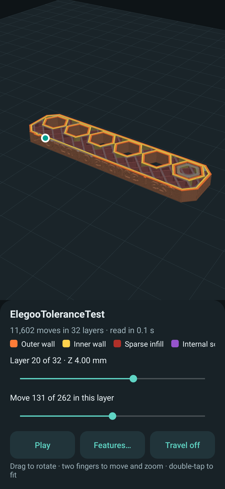
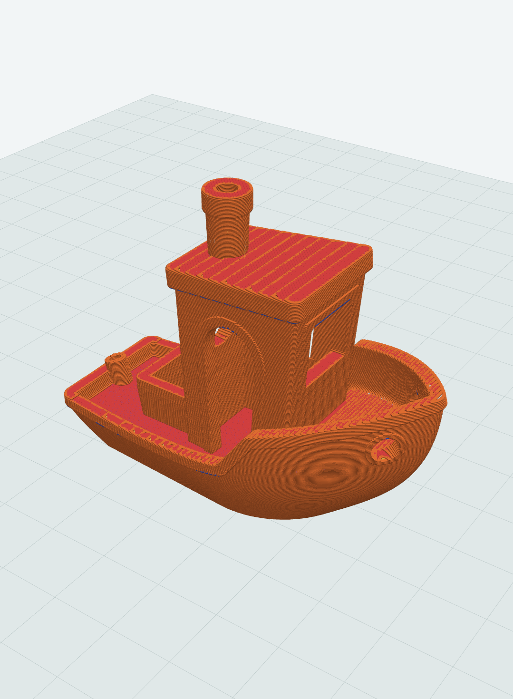
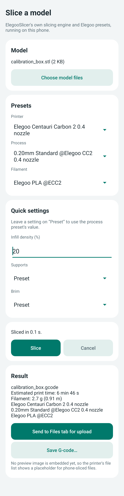
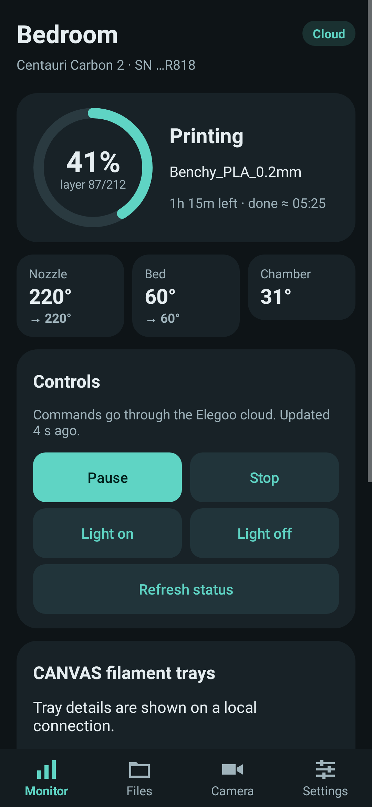
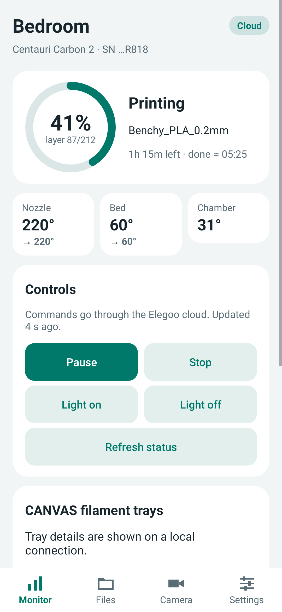

# Link Workshop for Android

**v0.12.9 (development):** printer files through the Elegoo cloud: files this app sent through the cloud are fetched back from Elegoo's storage with a signed link (no printer port needed); for other files the app checks Elegoo's file record and logs its field names (no values) so the next diagnostics show whether the cloud holds a copy, then falls back to the Wi-Fi download.

**v0.12.8:** failure handling batch B: cloud uploads wait their turn instead of failing at 50%, stalled storage uploads time out and cancel cleanly, finished slices are kept on the phone (Files → Recent slices…), the screen stays on while slicing and a killed slice offers to restore its models and settings, very large models are flagged before import, storage-full and partial-file messages, no uploading over the file being printed or starting while a transfer runs, recordings that survive clock changes, plain network error messages, and finish times with the day.

**v0.12.7:** failure handling: a printer that stops reporting through the cloud goes stale instead of looking live (fixes a 0.12.5 regression); a connection lost mid-upload ends the upload and keeps the sliced file in the Files tab; an unknown command outcome is said so; a lost connection mid-print raises an alert and retries for ten minutes; refused Elegoo sign-ins stop retrying and outages are not mistaken for an expired sign-in; a bad model pick keeps the earlier models; Back while slicing asks first; first-run Get started card.

**v0.12.6:** accessibility: TalkBack names for switches, fields and dropdowns, headings, announced status changes, expand/collapse and tab states, colour names instead of hex; layouts that hold at large text; better contrast; 48dp targets; select and move models in the layout without gestures (More… → Select a model…, Move…, Reset view). A refused cloud-mode download no longer claims the printer's file server is off: Elegoo's own cloud page downloads the same way.

**v0.12.5:** cloud uploads and controls no longer wait forever when Elegoo's online endpoint refuses the account (live updates and recent reports count as online), with a clearer upload hint and step-by-step upload diagnostics; one vocabulary across the app (Local / Cloud / Waiting for printer / Printer offline / Not connected, build plate vs project plate, Layout, Print profile, Printer controls, CANVAS 0 · tray 1).

**v0.12.4:** plate view problems no longer rely on colour (striped models with a ring on the bed; labels anchored to their model, pinned with an arrow when it is out of view, tap to go to it); a compact viewer legend with plain names; clearer sign-in, cloud details, cloud camera and print recordings (weekday, time, duration and result; clock-time charts).

**v0.12.3:** usability pass on the settings editor (everyday-word search, plain names, collapsible groups, changed settings named with Show changed only and per-row Reset), the plate view (problems written on the model, a compact panel with the 3D view taking most of the screen, More… for rarer actions) and the toolpath viewer (First layer, tap-to-hide legend, Live explained, model fitted to the frame).

**v0.12.2:** clarity pass from a task-by-task usability audit: hints that say what is missing with a way to fix it (Open Settings keeps the sliced file in Files), connection fields that say where to find the IP and code on the printer, home Wi-Fi before the cloud sign-in, plainer cloud-control and error texts, "Filament 1 · T0" naming throughout, a red Stop, a confirm before trays replace filaments, and a heater control that says it does not change sliced files.

**v0.12.1:** layout pass on the Slice and main screens: numbered steps, compact filament slots with colour dots, a plate chooser for multi-plate results, controls that say why they are off with one fix button, compact file and history rows, and Print setup in three sections (checks, build plate, filament) with tray colours.

**v0.12.0:** **Upload and print…** and Files uploads also work through the Elegoo cloud: the file goes to Elegoo's storage and the printer fetches it, as ElegooSlicer does; **Settings for one model…** (on the Slice screen, or **Model settings…** in the plate view) gives one model and its copies its own walls, infill, speeds, supports and other object settings, like the desktop's per-object settings; four more **calibration prints**: pressure advance lines and pattern, input shaping frequency and damping; a cloud-mode download that the printer refuses says so.

**v0.11.1:** downloads also work while the printer is watched through the Elegoo cloud: the app finds the printer on the same Wi-Fi by its serial and downloads from its HTTP port, as Elegoo's printer page does (Live toolpath's **Download from printer** and the Files tab).

**v0.11.0:** printer downloads fixed (no stale-list lockout, `%20` names like Elegoo's SDK, files in folders, odd content types and gzip handled) with a one-step **Download and save to phone**; **Upload and print…** after slicing uploads and opens Print setup with the trays filled in; a 3MF project's plates can all be sliced at once (one G-code each); **Lay on face** in the plate view; **Filament settings…** per slot (temperatures, flow ratio, pressure advance, max volumetric speed, retraction, cooling) with saved sets; and **calibration prints** from ElegooSlicer's Calibration menu: temperature tower, flow rate (two passes), pressure advance tower, max volumetric speed and retraction tower, each with how to read the result.

**v0.10.0:** a bigger slicer. **Edit plate…** opens a 3D view of the models on the bed to drag, turn, scale, copy and remove them, or have them arranged again; **All settings…** edits about 50 print settings (quality, walls, infill, speeds, support, adhesion, prime tower, vase mode and more) with the preset's value beside each, and saves sets of changes to reuse; **3MF projects** let you pick the plate to slice and use the project's own print settings and filaments. Before a slice that likely needs more memory than the phone has free, the app says so, and it tells you if Android closed it mid-slice. The **print history** shows each print's timelapse and downloads finished videos to save on the phone (over LAN).

 

**v0.9.0:** open STL, 3MF, OBJ and STEP files from other apps ("Open with" or Share) straight into the Slice screen; the Slice screen keeps its models, filament slots, settings, result and a running slice through rotation and theme changes; and a field-test diagnostics log (Settings → Share diagnostics…) records slicing time and memory, what the printer reports during Live toolpath, and CANVAS tray plans at print start. See [FIELD_TEST.md](FIELD_TEST.md).

**v0.8.1:** layout pass. Messages from actions now show in a banner under the header on every tab (tap to dismiss) instead of below the last card. Monitor lists CANVAS trays with colour swatches and the active tray. Files starts with Slice a model / Choose G-code and shows the file's actions only once one is chosen; transfer cancel buttons and paging appear only when they apply. Settings puts the connection fields and Connect first, with route, authentication and test tools under Advanced. The Slice screen keeps Slice / Cancel and progress pinned at the bottom, puts Fill from CANVAS trays above the slots and each model's filament with them, and scrolls to the result.

**v0.8.0:** multi-filament slicing with CANVAS trays. The Slice screen has filament slots (slot 1 is tool T0, slot 2 T1, …), each with a preset, a colour and an optional CANVAS tray; **Fill from CANVAS trays** makes one slot per loaded tray with the matching Elegoo preset and the tray's colour, and each model file gets a slot (3MF files can keep their own painting and parts). The engine computes flushing volumes from the colours and adds the prime tower as ElegooSlicer does, and the preview image shows each part in its colour. The slot-to-tray plan is remembered for the sliced file, so Print setup opens with the tool count and trays filled in.



**v0.7.1:** G-code sliced on the phone now carries the 144×144 preview image the printer shows in its file list, rendered by the engine like ElegooSlicer's desktop thumbnail.

**v0.7.0:** 3D toolpath viewer (Files → Preview toolpath, or Preview after slicing) with layer and move scrubbing, playback, feature filters and travel moves; **Live toolpath** on the Monitor tab follows the running print, using the printer's layer and nozzle position, with printed moves in color, the rest of the layer ghosted and lower layers dimmed. The app keeps copies of G-code it uploads, slices or downloads so it can show the file being printed, and can download it from the printer otherwise.

 

**v0.6.0:** slice STL, 3MF, OBJ, Draco and STEP models on the phone with ElegooSlicer's own engine and Elegoo presets (Files → Slice a model on this phone), then upload and print as usual. See [SLICER_PORT.md](SLICER_PORT.md) and [../slicer](../slicer/README.md); builds include the slicer only after `slicer/scripts/install-into-app.sh`.



**v0.5.0:** redesigned interface with bottom navigation, a progress ring and temperature tiles; with LAN Only off, monitoring, alerts, controls, printer settings, file browsing/start/delete, history, maintenance (filament, homing, leveling) and the camera through the Elegoo cloud; print recordings with graphs; live cloud updates (sign in under Settings → Elegoo account). See [CLOUD_LOGIN.md](CLOUD_LOGIN.md).

 

Independent native Android client in the Elegoo Link fork. **v0.3.5 source (unreleased)** aligns registration QoS with the SDK and adds secret-free broker/reply diagnostics. It retains the offline G-code workspace with embedded previews/material evidence, retains the experimental read-only cloud-mode PIN probe and home-VPN remote routing and retains System/Light/Dark appearance with separate Monitor, Files, Camera and Settings tabs. First target: Centauri Carbon 2, including the user's firmware V02.01.00.00. Minimum Android 8/API 26; compile/target Android 16/API 36.

The app ports the inspected LAN protocol to Java/Paho; it does not load the desktop C++ SDK. New features have automated transport/protocol coverage but have not been exercised on the user's physical printer. The latest supplied v0.3.3 screenshot reaches MQTT CONNECT but times out waiting for application registration; it does not prove PIN validity or Matrix coexistence; new features require the appropriate connection and firmware support.

v0.3.5 passed [GitHub Android CI](https://github.com/TheLastFrogrammer/elegoo-link/actions/runs/37402251862) (129 tests, zero failures/errors, zero lint errors, successful debug assembly), but has no compatible signed APK published yet: the local workspace holding the existing signing key is unavailable. The last verified download remains [v0.3.4](releases/0.3.4/README.md). GitHub Android CI validates source changes without publishing an installable APK or accessing the existing signing key.

## Included in v0.3.5 source

- **Registration diagnostics:** QoS 1 subscriptions and registration request match the SDK. Validate SUBACK before publishing and wait for PUBACK; distinguish malformed, wrong-client and retained replies from missing/rejected replies. Failure facts are bounded and redacted; the timeout no longer claims HTTP connected during the PIN probe. Long-press connection text to select/copy the report. Firmware support is not established.

- **Embedded previews/materials:** extract bounded PNG/JPEG comment blocks without network access; native decoding on the file worker; Material details shows configured color swatches, source-array indices and reported length/mass. Mismatched/malformed vectors retain uncertainty and do not become CANVAS assignments. Colon-style metadata headers are recognized. See [THUMBNAILS.md](THUMBNAILS.md).
- **Phone file workspace:** select a sliced .gcode file without connecting; bounded offline inspection of supported slicer comments, explicit T selections, exact size and SHA-256; share its report, save a phone copy through Android's document picker or clear the cache copy. No inferred tray mapping or automatic tool count.
- **Printer downloads:** choose a listed internal/USB G-code file and Download to phone workspace, with cancellation and partial-cache cleanup. Requires LAN authentication, fresh file list and HTTP port 80; respects local/VPN routing and effective session token. Downloads and uploads are serialized; completed copies are inspected and can be exported. See [FILE_WORKSPACE.md](FILE_WORKSPACE.md).
- **Matrix coexistence probe:** explicit authentication choice independent of local/VPN route; separate masked, memory-only current pairing PIN; UDP/manual identity with no HTTP bootstrap; session-level changing-command/upload blocks; no automatic retries, credential fallback, account login or binding changes. Firmware coexistence is unverified. Follow [MATRIX_COEXISTENCE.md](MATRIX_COEXISTENCE.md) and the in-app guide.
- **Remote VPN route:** Settings → Connection route → Remote through home VPN. MQTT, HTTP and camera follow the app's default VPN route; active-VPN checks, route-loss monitoring, remote camera-port diagnostics, selected-IP identity discovery and saved route preferences are included. Set up your home Pi gateway using [REMOTE_ACCESS.md](REMOTE_ACCESS.md). App checks do not replace Android's block-without-VPN enforcement. Physical remote validation remains pending.

- **Appearance:** Settings → App preferences → Appearance → System, Light or Dark. Preference survives restarts; native dialogs, inputs, cards, buttons and system bars use the selected palette. Changing theme recreates the screen while the service retains the printer connection.
- **Monitoring:** printer/firmware identity, full/delta status, progress, layers, remaining time, temperatures/targets, fault codes, CANVAS materials/colors/tray IDs and automatic refill.
- **Files:** internal/USB browsing in pages of 50; reported metadata; confirmed idle-only deletion; existing upload flow with independent cancellation and file-list refresh after completion. Uploads require HTTP port 80. A partial cancelled upload may remain on the printer.
- **Print setup:** choose a listed G-code file, bed/printer check, forced leveling, plate A/B, printer-side timelapse and 1–8 used tools. Leave every tool on printer/G-code default or map every tool to a currently reported connected CANVAS tray. Verify tool count against the sliced file. A final confirmation starts the print. This app does not slice or infer G-code tool count.
- **Controls:** confirmed pause/resume/stop, light on/off, idle temperature targets (app bounds: nozzle 0–300°C and bed 0–100°C), part/auxiliary/chamber fan percentage and printing speed modes. No axis jogging or homing is exposed.
- **Camera:** request the printer's stream address or use its local MJPEG endpoint; independent of MQTT registration; bounded JPEG frames and playback up to 5 fps, larger view and Save snapshot through Android's document picker. Only HTTP/HTTPS on the selected printer IP is accepted; redirects are disabled. Playback stops when leaving Camera or backgrounding the Activity; monitoring continues independently.
- **Profiles/discovery:** read-only Wi-Fi discovery picker, up to 20 named profiles, one active printer at a time; per-IP opt-in encrypted access codes using Android Keystore AES-GCM. Legacy single-printer encrypted data migrates in place. Codes never enter Activity saved state, diagnostics or logs.
- **History/alerts:** internal storage usage and up to 50 newest reported history rows; optional notification for observed print completion or newly reported fault codes. Completion requires an observed job and explicit completed state; idle, cancellation, stale status and reconnect gaps do not imply completion. Alerts require notification permission and a live monitoring process.
- **Connection reliability:** local Wi-Fi/Ethernet network binding, layered TCP/UDP/HTTP checks, optional manual serial, discovery authentication flags, foreground service ownership and up to five connection-only retries. Authentication failures are terminal. Commands and uploads are never replayed automatically.

Official cloud login, verified complete tool/mapping suggestions, timelapse export, filament loading/unloading, file thumbnails, axis motion, multiple simultaneous printers, other models and phone-side slicing remain future work. Camera/files may be unsupported on older firmware; errors/timeouts leave the main monitor available.

## Install and connect

1. Download `Link-Workshop-v0.3.4.apk` from this release. It uses the same development signing certificate as v0.2.0–v0.3.3, allowing a normal update that preserves app data. v0.1.0 used an older lost signing key and may need uninstalling first.
2. Choose Local Wi-Fi / Ethernet first. Authentication is separate: **LAN access code** requires printer LAN Only and the code from that setting; discovery explicitly reporting protection off selects the upstream default. **Cloud-mode PIN probe (read-only)** keeps LAN Only off and uses the current printer-displayed pairing PIN in a separate field. This candidate may be refused by firmware; do not substitute the LAN code, unbind or re-pair. Read [MATRIX_COEXISTENCE.md](MATRIX_COEXISTENCE.md). After the chosen authentication works locally, follow [REMOTE_ACCESS.md](REMOTE_ACCESS.md) for the Pi/VPN route.
3. Use Find printers on Wi-Fi or leave serial blank for identity discovery. If identity discovery fails, enter the exact Serial Number from printer Settings → Device. Discovery still checks authentication mode with a supplied serial and its returned serial takes priority. A manual serial does not bypass MQTT authentication. PIN probe never falls back to HTTP identity.
4. Use Check connection, then Connect. MQTT 1883 provides monitoring/controls in LAN mode; the PIN probe enables read queries only. HTTP 80 is optional for identity and required for this upload implementation. Camera uses its own printer endpoint, normally port 8080; remote diagnostics also probe that port. TCP reachability alone does not prove authentication or registration. MQTT code 5 means not authorized, rather than proving the password was mistyped.
5. Allow notifications for connection/completion/fault visibility. Denial does not block the foreground service; Disconnect remains available in the app. Compare Monitor with the printer touchscreen before using LAN controls, then validate print setup on a suitable test job. For the PIN probe, also check Matrix remains live; registration alone does not establish coexistence.

LAN Only is an optional full-control authentication route, not an Android requirement. Cloud-mode local PIN access is a separate explicit read-only experiment; Matrix coexistence depends on firmware and remains unverified. The probe does not request disconnection of other clients, but firmware registration limits could still affect them. No official cloud account adapter is included. Printer HTTP/MQTT follows upstream plaintext LAN transport. No router port forwarding is needed. Remote mode tunnels these protocols to a user-managed home gateway; the Pi-to-printer LAN hop remains plaintext. Do not expose printer ports to the public internet.

Screen-off battery management can suspend activity; no wake lock is held. Process death stops the session rather than restarting it or replaying work. Unsupported feature responses are shown without interpreting an acknowledgement as proof of the physical result. Stop prioritizes the next spaced request slot over queued reads; it is not an emergency-stop mechanism.

## Build

JDK 17, Android SDK platform 36/build tools 35.0.0, Gradle 8.13 and AGP 8.11.1:

```sh
./gradlew --no-build-cache clean testDebugUnitTest lintDebug assembleDebug
```

APK: `app/build/outputs/apk/debug/app-debug.apk`; app ID `io.github.thelastfrogrammer.elink`; v0.3.5/code 10 (source; signed update not yet published). Retain your signing key privately for compatible subsequent installs. No printer/cloud credentials are required to build.

See [FILE_WORKSPACE.md](FILE_WORKSPACE.md), [MATRIX_COEXISTENCE.md](MATRIX_COEXISTENCE.md), [PROTOCOL.md](PROTOCOL.md), [ROADMAP.md](ROADMAP.md), [VALIDATION.md](VALIDATION.md), and the on-phone slicer plan in [SLICER_PORT.md](SLICER_PORT.md). Apache-2.0 applies to this repository; Eclipse Paho EPL-2.0/EDL-1.0 attribution is in [THIRD_PARTY_NOTICES.md](THIRD_PARTY_NOTICES.md). No official app assets are copied.

## Releases

`.github/workflows/android-ci.yml` runs the unit tests, lint and a debug build for pull requests and pushes to `android/cc2-foundation`. Pushing a tag such as `android-v0.5.0` runs `.github/workflows/android.yml`, which tests again, builds a release APK signed with your key and publishes it as a GitHub Release with its SHA-256.

One-time setup, in the repository's **Settings → Secrets and variables → Actions**:

- `LINK_WORKSHOP_KEYSTORE_BASE64`: your signing keystore, base64-encoded (`base64 -w0 your-key.jks`)
- `LINK_WORKSHOP_KEYSTORE_PASSWORD`, `LINK_WORKSHOP_KEY_ALIAS`, `LINK_WORKSHOP_KEY_PASSWORD`

Use the same key as v0.2.0–v0.3.5 so releases install as updates. Local signed builds read the same four names from the environment or `~/.gradle/gradle.properties` (`LINK_WORKSHOP_KEYSTORE` is then the keystore's path). Keystores are git-ignored. New APKs are no longer committed to `android/releases/`; the older ones stay for their existing links.
